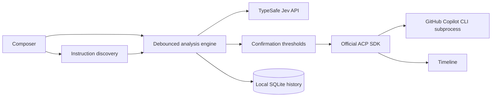

# Prompt Oscilloscope

Prompt Oscilloscope is a terminal client that analyzes a prompt with TypeSafe Jev before sending the original text unchanged to the installed GitHub Copilot CLI over the Agent Client Protocol (ACP).

It ships in two forms:

- **ACP terminal client:** `oscope` keeps the full GitHub Copilot CLI agent workflow, tools, permissions, and slash commands.
- **VS Code extension:** `@oscope` runs inside native Copilot Chat with the selected chat model, native sessions, and native Markdown rendering. See [`extensions/vscode`](extensions/vscode).

It does not rewrite prompts or intercept another composer. Ambiguous, conflicting, or risky prompts require a second Enter before they are sent.

## Status

This is an early v1 implementation. The TypeSafe Jev model is pinned to `jev-1.13.0`, and the stable ACP v1 SDK is pinned to 1.4.0.

## Demos

Click a preview to open the video in Google Drive.

### Jev + ACP terminal

<p>
  <a href="https://drive.google.com/file/d/1EW1-eCV-IF-b07vDeGfR0bHy3gjjWJxh/view?usp=drive_link">
    
  </a>
  <a href="https://drive.google.com/file/d/1FP-XaoPrtOmb5FwBvWM-Ehg4GsZA_FA8/view?usp=drive_link">
    
  </a>
</p>

### Jev + VS Code `@oscope`

<p>
  <a href="https://drive.google.com/file/d/1TnkngBocr2NRBTIkuQIJn-Lea9n0GONL/view?usp=drive_link">
    
  </a>
  <a href="https://drive.google.com/file/d/1Ixw9IUyzP0OGx7X4CBRoGIv6D7brcVXk/view?usp=drive_link">
    
  </a>
</p>

## Requirements

- Node.js 22 or newer
- pnpm 10.17.1
- GitHub Copilot CLI installed and authenticated
- A `TYPESAFE_API_KEY`

## Install and run

```sh
corepack enable
pnpm install
pnpm build
pnpm link --global
oscope
```

Create `.env` in the directory where you run `oscope`:

```dotenv
TYPESAFE_API_KEY=your_key_here
```

The included `.env` is ignored by Git. Never commit the real key. Normal `oscope` runs are live and use both Jev and GitHub Copilot CLI. The optional `--offline` flag uses simulated responses for UI testing.

Run `oscope` from the repository you want Copilot to work in. Prompt Oscilloscope starts a new GitHub Copilot CLI session for that directory through ACP. This terminal session is independent of the separately packaged VS Code extension and does not attach to an existing VS Code Chat conversation.

The interaction is:

1. Compose a prompt in Prompt Oscilloscope.
2. Wait for `Prompt check fresh` directly above the composer and review the outcome-colored signals.
3. Press Enter to send. Risky or ambiguous prompts require a second Enter.
4. Follow the `You` and `Copilot` conversation in the transcript above the analysis panel.
5. Approve or reject tool permissions when Copilot requests them.

A full red bar with `unclear confidence 100%` means Jev is highly confident that the prompt is unclear. Bar length is confidence; color is outcome severity.

Run the offline simulator without credentials or Copilot:

```sh
node dist/cli.js --offline
```

Offline mode uses fixed responses and never makes a network request. `--demo` remains as a compatibility alias. Its reproducible VHS recording source is in `demo/demo.tape`.

## VS Code extension

Build and package the extension locally:

```sh
pnpm extension:build
pnpm extension:package
code --install-extension extensions/vscode/dist/prompt-oscilloscope-vscode.vsix --force
```

Reload VS Code after installation, run **Prompt Oscilloscope: Set TypeSafe API Key**, and invoke `@oscope` in Copilot Chat. The extension stores the key in VS Code SecretStorage and uses the model selected in Copilot Chat.

- `@oscope <prompt>` analyzes and sends when no confirmation is recommended.
- `@oscope /analyze <prompt>` displays diagnostics without invoking the selected model.
- `@oscope /send <prompt>` explicitly sends after analysis even when confirmation is recommended.

The VS Code participant and ACP terminal share Jev analysis, thresholds, and repository instruction discovery. They do not share Copilot sessions: the extension uses the native Chat participant API, while the terminal uses Copilot CLI over ACP.

## Controls

| Key        | Action                                               |
| ---------- | ---------------------------------------------------- |
| Enter      | Send, or arm/confirm a risky prompt                  |
| Ctrl+Enter | Insert a newline                                     |
| Ctrl+U     | Clear the entire draft                               |
| Tab        | Expand probability distributions                     |
| Escape     | Clear confirmation or cancel the active Copilot turn |
| Ctrl+C     | Close the ACP session and quit                       |

Composer commands:

- `/history` shows the ten most recent entries in the timeline.
- `/history clear` deletes all local history.
- `/cancel` cancels the active Copilot turn.
- `/quit` closes the app.

Non-interactive history commands are also available:

```sh
oscope --history
oscope --delete-history <id>
oscope --delete-history all
```

## What is analyzed

One Jev request evaluates predefined probability labels for goal clarity, task type, target context, constraints, success criteria, goal compatibility, expected behavior, material risk, and instruction conflict. The interface displays only those predefined labels and distributions.

Empty prompts, excessive length, and likely secrets are checked locally. Analyses are debounced by 350 ms, stale requests are cancelled, and results are cached by a SHA-256 hash of the prompt and instruction context.

Instruction discovery includes:

- Personal instructions configured with `OSCOPE_PERSONAL_INSTRUCTIONS`
- `~/.copilot/copilot-instructions.md` and `~/.github/copilot-instructions.md`
- Repository `CONTRIBUTING.md`
- Repository `.github/copilot-instructions.md`
- Root and applicable nested `AGENTS.md` files
- Matching `.github/instructions/*.instructions.md` files
- Explicit `@file` references used to select path-specific instructions

Each file is capped at 16,000 characters and total instruction context at 64,000 characters. Included filenames and truncation status are visible in the interface.

`CONTRIBUTING.md` is treated as repository-wide guidance. For example, a prompt that forbids required tests can be reported as conflicting when the contribution rules require behavioral changes to be tested.

## Architecture



The Copilot process is always launched as `copilot --acp --stdio`; authentication remains owned by the official CLI. ACP file requests are restricted to the current workspace. Permission requests are presented as choices and never approved automatically.

## Privacy and storage

Prompt text and bounded instruction contents are sent to TypeSafe for analysis. Review TypeSafe's current privacy and retention terms before use. The same original prompt is then sent to GitHub Copilot only after any required confirmation.

History is stored by default in `~/.prompt-oscilloscope/history.db`. It contains prompt text, predefined Jev results, model, measured latency, configured cost estimate, token counts, and send decisions. It does not store API keys, Copilot credentials, or instruction-file contents. History is local and enabled by default.

## Cost

The TypeSafe SDK reports token counts but no monetary cost. Prompt Oscilloscope never invents one. Configure current per-million-token rates to display an estimate:

```sh
$env:OSCOPE_INPUT_COST_PER_MILLION="0.00"
$env:OSCOPE_OUTPUT_COST_PER_MILLION="0.00"
```

Without both values, the interface displays `cost not configured`.

## Calibration and limitations

Jev probabilities are diagnostics, not policy decisions. Thresholds are initial product defaults and should be calibrated against representative prompts before high-stakes use. Local secret detection is intentionally conservative and incomplete.

The client supports new and resumed ACP sessions internally; the v1 UI starts a new session. It streams messages and tool activity, supports permissions and cancellation, and passes slash-command text through to Copilot except for the local commands documented above.

Copilot session commands advertised over ACP, including `/plan`, `/allow-all`, and `/autopilot`, are forwarded unchanged. Native Copilot CLI launch flags and keyboard-only UI controls are not slash commands; configure equivalent behavior through an advertised command when available.

Copilot slash commands bypass Jev because they configure the active Copilot session rather than describe a coding task. Assistant Markdown is rendered for terminal display; the original prompt and Copilot response text are not rewritten.

Node's built-in `node:sqlite` API may emit an experimental warning on Node 22 and 24. The database schema is deliberately small and versioned with `PRAGMA user_version`.

## Development

```sh
pnpm validate
pnpm pack:check
pnpm extension:package
```

Tests use fake Jev and ACP implementations and do not consume paid services. CI validates Node.js 22 and 24 on Windows, macOS, and Linux.

The TypeSafe SDK 0.6.0 runtime and declarations are included under `vendor/typesafe-ai-sdk` because some enterprise npm proxies do not mirror its scope. The files are the unmodified official npm artifacts and retain the upstream MIT license.

## License

No license is granted for this repository or its contents. You may view and fork the public GitHub repository under GitHub's Terms of Service, but no general permission to use, copy, modify, or distribute the code is provided.
